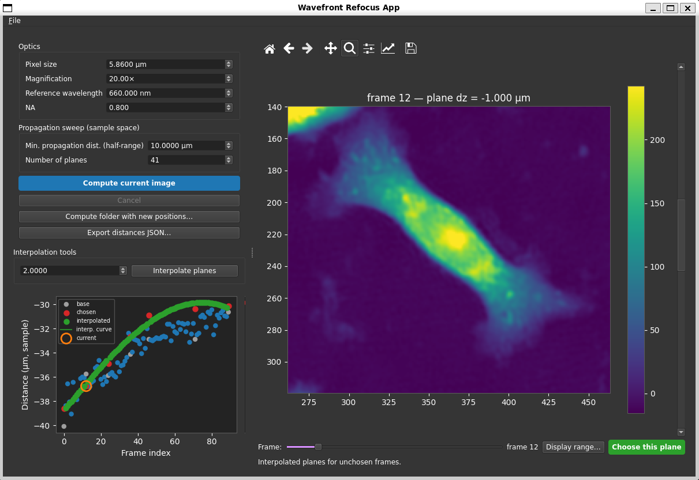

# Wavefront Refocus App

Interactive refocusing of wavefronts reconstructed from a Digital Holographic
Microscope (DHM). Reconstructed images are often not on the ideal focal plane;
this tool lets you numerically propagate each frame, pick the best plane,
interpolate planes for the remaining frames, and re-export the whole sequence
refocused.

// Add image: 


## Install

```bash
pip install -e .
# optional GPU acceleration (CUDA build matching your system):
pip install torch   # see https://pytorch.org/get-started/locally/
```

The numerical engine uses PyTorch + CUDA when available and falls back to NumPy
otherwise.

## Run

```bash
python -m wavefront_refocus
# or, after install:
wavefront-refocus
```

## Input layouts

The app loads four data organisations (chosen in the open dialog):

1. **Intensity folder + OPD folder** — per-frame `.tif`; OPD in nanometres.
   You are asked for the reference wavelength to convert OPD → phase.
2. **Intensity folder + Phase folder** — per-frame `.tif`; phase in radians.
3. **Single multi-frame wavefront stack** — one TIFF, 2 channels
   (phase, intensity) with a time axis.
4. **Folder of wavefront stacks** — each file is one frame's phase+intensity
   stack.

Frame order is the natural-sorted file order (or the time axis for a single
stack). Alongside the data you load a `Reconstruction_Distances.json` mapping
each frame index to a `{wavelength_nm: distance_m}` table. You can select
several such files at once — they are merged before loading, which is how a
chunked acquisition is reassembled (see *Recombining chunks* below).

### Partial loading (working in chunks)

The open dialog shows how many frames a selection holds and offers a **Frame
range**: tick *Load only frames* and give an inclusive `first`–`last` to load a
slice instead of the whole sequence. A 480-frame folder can then be worked
through as 0–50, 51–150, 151–479, refocusing and exporting each chunk in turn —
useful when a sequence is too long to review in one sitting.

Frames keep their index in the **full** sequence, which is what makes chunking
safe: chunk 51–150 stays frames 51…150 throughout, so distances-JSON lookups
hit the right entries, exported files are named `frame_0051…frame_0150`, and
successive chunks never overwrite each other. Export each chunk to its own
directory (its distances JSON covers only that chunk's frames) and merge them
afterwards if you want a single sequence. Interpolation and the *Apply to
frames* list also use these real frame numbers, and a frame outside the loaded
chunk is reported rather than silently skipped.

Interpolation only ever sees the frames in the current chunk, so planes are
extrapolated at the chunk edges rather than interpolated across a boundary. If
that matters, overlap your chunks by a few frames.

### Recombining chunks

Once each chunk has been refocused and its distances JSON exported, the whole
acquisition can be brought back together: in the open dialog, select **all** the
per-chunk JSONs at once (the Browse button is multi-select) and load the full
frame range. The files are merged into one table before the frames are bound,
so frames 0–70 open with every plane you chose across the separate sessions.

Because each chunk's JSON holds absolute distances, the merged table *is* the
refocused state — reloading it and exporting gives one sequence with all the
work applied.

**File → Merge distances JSONs…** does the same merge standalone and writes the
combined file, without loading any image data.

### Transferring distances

**File → Transfer distances…** replays refocusing recorded elsewhere onto the
frames currently loaded. You give a **target** JSON (where frames should end
up) and optionally an **input** JSON (where they were when that target was
produced); what gets applied is the per-frame difference `target − input`,
converted to sample space and stored as that frame's *chosen* plane.

Leave the input empty — the usual case when the dataset was opened without
distances — and the input counts as 0, so the target is applied outright.

The difference matters when the current sequence sits on a different base than
the one the target came from: transferring the *delta* carries over how far
each frame was displaced rather than where it happened to land, so the
refocusing still applies. When the input matches the current distances exactly,
the two are equivalent.

The dialog previews before anything changes — how many frames are affected, the
displacement range, which frames it would overwrite, which are missing from the
target (left untouched), which target frames aren't loaded here (ignored), and
which are absent from the input (input taken as 0). Nothing is modified until
you press **Apply transfer**.

Transferred planes behave exactly like planes you picked by hand: they show in
the *chosen* colour, anchor interpolation, and can be recomputed or overridden
per frame afterwards.

Both paths report anything you should check before trusting the result:

- **Conflicts** — a frame defined *differently* in two files (e.g. you redid a
  chunk with different boundaries). The **last file selected wins**, and the
  affected frames are listed, so pick your selection order deliberately.
- **Duplicates** — a frame repeated with the *same* value, which is what
  overlapping chunks normally produce. Harmless, reported for completeness.
- **Gaps / uncovered frames** — frames no file covers. These silently fall back
  to a 0.0 distance, so a gap usually means a chunk was never exported.

## Conventions

- **Reconstruction distances are absolute and in image space.** For each frame
  the distance is read from the wavelength key nearest the UI reference
  wavelength.
- **The UI works and displays in sample space.** The axial conversion is
  `dz_image = dz_sample * M²` (M = magnification). On export, the chosen
  sample-space displacement is converted back to image space and added to the
  absolute distance.
- **Sweep parameters**: "minimal propagation distance" is the *half-range*
  (maximum excursion each side, sample space) and "number of planes" is the
  total plane count (rounded up to an odd number so the current plane is
  included), distributed symmetrically around the sweep centre.
- **Sweep centre**: by default a sweep is centred on the frame's *current*
  position — its chosen or interpolated plane, or the base plane if it has
  none yet. So after picking a plane at +4 µm, recomputing with a ±2 µm
  half-range explores 2…6 µm instead of re-covering planes you already know
  are out of focus. Tick **Centre sweep on** to pin every sweep to an explicit
  offset instead. Plane distances stay relative to the frame's base plane, so
  choosing a plane means the same thing either way.
- **Exported phase is unwrapped**, matching what the phase view displays.
  Writing raw `angle()` would clamp phase into [-π, π], so any structure taller
  than π folds back on itself and a bright bead reads as a dark speck at its own
  peak. Unwrapped phase differs only by multiples of 2π, so `exp(i·phase)` — and
  every downstream propagation — is unchanged when the file is reloaded.
- **Interpolation** fits a curve to (frame index, chosen sample distance) over
  the frames you chose, with explicit linear extrapolation beyond the chosen
  range. Two methods are available: a **smoothing spline** (with an exposed
  smoothing factor) and **linear**, which joins the chosen planes with straight
  segments so the curve passes exactly through each one and never overshoots
  between them.

## Workflow

1. Open a dataset and its distances JSON — optionally only a frame range of it
   (see *Partial loading* above).
2. Select a frame (slider or by clicking a point in the distance graph) to view
   its unwrapped phase at the file/base plane.
3. Adjust optical and sweep parameters, press **Compute current image** to
   propagate around the current plane (runs in the background).
4. Scrub the vertical plane scrollbar and press **Choose this plane**. The old
   point greys out and a coloured point appears at the new position.
5. Repeat for several frames, then run **Interpolation tools** to estimate the
   planes of the remaining frames (shown in another colour, clickable).
   Leave **Apply to frames** empty to fill in every frame you have not chosen
   a plane for, or name the ones to redefine — `1,38,39,100`, or ranges like
   `0-9, 25, 40-45` — to rewrite only those and leave the rest untouched.
   Listing a frame you had *chosen* releases it back onto the fitted curve
   (and drops it from the fit); the status line reports which ones.
6. **Compute folder with new positions** to export the refocused sequence in
   one of the four formats, plus an updated distances JSON. A progress bar
   tracks the export. Tick **Keep original file names** to reuse the input
   names instead of `frame_0000.tif`, … (see *Output file names* below).
   (**Export distances JSON…** writes just the JSON, which is enough to save a
   chunk's work and come back to it later.)
7. Working in chunks? Repeat 1–6 per chunk, then reopen the full frame range
   with all the per-chunk JSONs selected together to carry on with the whole
   sequence (see *Recombining chunks* above).

## Output file names

By default exports are named by frame index — `frame_0000.tif`, `frame_0001.tif`,
… — which keeps them aligned with the distances JSON and orders correctly.

Tick **Keep original file names** in the export dialog to reuse each input
file's name instead. The paired layouts keep *each side's* own name, so an
`acqA_t000_int.tif` / `acqA_t000_ph.tif` pair exports under those two names
rather than one shared one.

Two cases can't simply reuse a name, and both are handled rather than silently
overwriting:

- **Slices of a multi-frame stack** share a single source file, so there is no
  per-frame name to keep. Exported as one folder of frames they become
  `movie.tif`, `movie_2.tif`, `movie_3.tif`, …
- **Repeated names** — two inputs called `same.tif` from different folders —
  are suffixed the same way: `same.tif`, `same_2.tif`.

Frames with no usable source filename fall back to the indexed form. Exporting
to the single-stack format writes one file, which takes the source stack's name.

The distances JSON is always keyed by frame index, whichever naming you choose.

## Navigation

Step buttons flank the frame slider (`◀ ▶`) and the plane scrollbar (`▲ ▼`) for
single-step moves; hold one to scrub. The arrow keys do the same while the
phase view has focus: **Left/Right** change frame, **Up/Down** (or
**PgUp/PgDn**) change plane. The label under the plane scrollbar shows the
current plane index.

## Display

The UI uses a dark theme. The image colour scale is set from percentiles of
the (border-cropped, zero-centred) data; open **Display range…** under the
phase view for a floating window to adjust the low/high percentiles and the
border crop live.

## Development

```bash
pip install -e ".[dev]"
pytest
```
